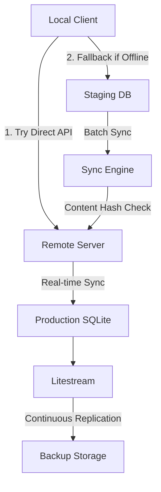

# MCP Memory Service

[](https://opensource.org/licenses/Apache-2.0)
[](https://github.com/doobidoo/mcp-memory-service/stargazers)
[](https://github.com/doobidoo/mcp-memory-service/network/members)
[](https://github.com/doobidoo/mcp-memory-service/issues)
[](https://github.com/doobidoo/mcp-memory-service/commits)

[](https://smithery.ai/server/@doobidoo/mcp-memory-service)
[](https://mseep.ai/app/0513fb92-e941-4fe0-9948-2a1dbb870dcf)

[](https://claude.ai)
[](https://cursor.sh)
[](https://codeium.com/windsurf)
[](https://lmstudio.ai)
[](https://zed.dev)

[](https://modelcontextprotocol.io/)
[](https://github.com/doobidoo/mcp-memory-service#features)
[](https://github.com/doobidoo/mcp-memory-service#hardware-compatibility)
[](https://github.com/doobidoo/mcp-memory-service#-in-production)
[](https://github.com/doobidoo/mcp-memory-service#storage-backends)
[](https://github.com/doobidoo/mcp-memory-service#storage-backends)

A **universal MCP memory service** providing **semantic memory search**, persistent storage, and **autonomous memory consolidation** for **AI assistants** and development environments. This **Model Context Protocol server** works with **Claude Desktop, VS Code, Cursor, Continue, WindSurf, LM Studio, Zed, and 13+ AI applications**, featuring **multiple storage backends** including **SQLite-vec** for **fast local search**, **Cloudflare** for **global edge distribution**, and a revolutionary **dream-inspired consolidation system** that automatically organizes, compresses, and manages your **AI conversation history** over time, creating a **self-evolving knowledge base** for enhanced **AI productivity**.


<a href="https://glama.ai/mcp/servers/bzvl3lz34o"></a>

## Help
- Talk to the Repo with [TalkToGitHub](https://talktogithub.com/doobidoo/mcp-memory-service)!
- Use Gitprobe to digg deeper: [GitProbe](https://gitprobe.com/doobidoo/mcp-memory-service)!

---

## 📋 Table of Contents

### 🚀 Getting Started
- [⚡ Quick Start](#-quick-start)
- [🌍 Cloudflare Backend (v6.2.0)](#cloudflare-v620---cloud-native-)
- [🧠 Claude Code Memory Awareness (v6.0.0)](#-new-claude-code-memory-awareness-v600)
- [🎯 Claude Code Commands (v2.2.0)](#-new-claude-code-commands-v220)
- [🚀 Remote MCP Memory Service (v4.0.0)](#-new-remote-mcp-memory-service-v400)
- [🔄 Distributed Memory Synchronization (v6.3.0)](#-new-distributed-memory-synchronization-v630)
- [📦 Installation Methods](#installation-methods)
- [⚙️ Claude MCP Configuration](#claude-mcp-configuration)

### 🌟 Features & Capabilities
- [✨ Features Overview](#features)
- [🧠 Dream-Inspired Memory Consolidation](#-dream-inspired-memory-consolidation)
- [💾 Storage Backends](#storage-backends)
- [🔧 Memory Operations](#memory-operations)

### 🌐 Deployment & Multi-Client
- [🌐 Multi-Client Deployment](#-multi-client-deployment)
- [🔒 SSL/TLS Configuration](#ssltls-configuration)
- [🚀 Service Installation](#-service-installation-new)

### 📖 Documentation & Support
- [📝 Usage Guide](#usage-guide)
- [⚙️ Configuration Options](#configuration-options)
- [🖥️ Hardware Compatibility](#hardware-compatibility)
- [🧪 Testing](#testing)
- [❓ FAQ](#faq)
- [🛠️ Troubleshooting](#troubleshooting)
- [📚 Comprehensive Documentation](#-comprehensive-documentation)

### 👨‍💻 Development & Community
- [🏗️ Project Structure](#project-structure)
- [📋 Development Guidelines](#development-guidelines)
- [🤝 Integrations](#integrations)
- [💖 Sponsorship](#-why-sponsor-mcp-memory-service)

---

## 🚀 Quick Start

Choose your preferred installation method to get started in under 5 minutes:

### Option 1: Docker (Fastest - 2 minutes)
```bash
# Pull and run with default settings
docker pull doobidoo/mcp-memory-service:latest
docker run -d -p 8000:8000 -v $(pwd)/data:/app/data doobidoo/mcp-memory-service:latest
```
✅ **Perfect for**: Testing, production deployment, isolation  
➡️ [Complete Docker Setup](#docker-installation)

### Option 2: Smithery (Simplest - 1 minute)  
```bash
# Auto-install for Claude Desktop
npx -y @smithery/cli install @doobidoo/mcp-memory-service --client claude
```
✅ **Perfect for**: Claude Desktop users, zero configuration  
➡️ [Smithery Details](#installing-via-smithery)

### Option 3: Python Installer (Most Flexible - 5 minutes)
```bash
# Clone and install with hardware detection
git clone https://github.com/doobidoo/mcp-memory-service.git
cd mcp-memory-service && python install.py
```
✅ **Perfect for**: Developers, customization, multi-client setup  
➡️ [Full Installation Guide](#-intelligent-installer-recommended)

---

## 🧠 NEW: Claude Code Memory Awareness (v6.0.0)

**Revolutionary automatic memory injection for Claude Code sessions!**

Transform your development experience with intelligent, automatic memory context that appears seamlessly in every Claude Code session. Never lose track of decisions, insights, or architectural choices again.

### ✨ Automatic Memory Injection

```bash
# Install the memory awareness hook system
cd claude-hooks && ./install.sh

# Every Claude Code session now starts with relevant context:
# 🧠 Relevant Memory Context
# 
# ## Recent Insights (Last 7 days)
# - Database Performance Issue - Resolved SQLite-vec optimization (yesterday)
# - Authentication Flow - Implemented JWT validation (3 days ago)
# 
# ## Key Decisions  
# - Architecture Decision - Chose React over Vue (1 week ago)
# - Database Choice - Selected PostgreSQL for production (2 weeks ago)
```

### 🎯 Features

🤖 **Zero Cognitive Load**: Memory context appears automatically without user intervention  
🧠 **Intelligent Selection**: Advanced scoring algorithm chooses only relevant memories  
⚡ **Lightning Fast**: Memory injection adds <2 seconds to session startup  
📊 **Multi-Language Support**: Detects JavaScript, Python, Rust, Go, Java, C++ projects  
🏗️ **Context-Aware**: Understands your project structure, git repo, and technology stack  
📝 **Beautiful Formatting**: Categorized, markdown-rich memory presentation  
🔄 **Session Learning**: Automatically stores session outcomes for future reference  
✅ **100% Test Coverage**: Comprehensive testing with complete integration validation  

### 🚀 Installation

```bash
# Clone repository and install hooks
git clone https://github.com/doobidoo/mcp-memory-service.git
cd mcp-memory-service/claude-hooks
./install.sh

# Verify installation
npm test  # 10 tests, all passing
```

### 🏗️ How It Works

1. **Session Start**: Hook detects project context (language, framework, git info)
2. **Memory Query**: Searches memory service for relevant memories using multi-factor scoring
3. **Context Injection**: Formats and injects top 8 relevant memories as session context
4. **Session End**: Analyzes conversation and stores outcomes with intelligent tagging

### 📊 Memory Scoring Algorithm

```javascript
// Multi-factor relevance scoring
const relevanceScore = (
  timeDecayScore * 0.4 +         // Recent memories preferred
  tagRelevanceScore * 0.3 +      // Project-specific tags
  contentSimilarityScore * 0.2 + // Semantic matching  
  memoryTypeBonusScore * 0.1     // Decision/insight bonus
);
```

➡️ [**Technical Architecture**](docs/enhancement-roadmap-issue-14.md) | [**Installation Guide**](claude-hooks/README.md) | [**Test Results**](claude-hooks/tests/)

---

## 🎯 NEW: Claude Code Commands (v2.2.0)

**Get started in 2 minutes with direct memory commands!**

```bash
# Install with Claude Code commands
python install.py --install-claude-commands

# Start using immediately
claude /memory-store "Important decision about architecture"
claude /memory-recall "what did we decide last week?"
claude /memory-search --tags "architecture,database"
claude /memory-health
```

✨ **5 conversational commands** following CCPlugins pattern  
🚀 **Zero MCP server configuration** required  
🧠 **Context-aware operations** with automatic project detection  
🎨 **Professional interface** with comprehensive guidance  

➡️ [**Quick Start Guide**](docs/guides/claude-code-quickstart.md) | [**Full Integration Guide**](docs/guides/claude-code-integration.md)

## 🚀 NEW: Remote MCP Memory Service (v4.0.0)

**Production-ready remote memory service with native MCP-over-HTTP protocol!**

### Remote Deployment

Deploy the memory service on any server for cross-device access:

```bash
# On your server
git clone https://github.com/doobidoo/mcp-memory-service.git
cd mcp-memory-service
python install.py
python scripts/run_http_server.py
```

**Server Access Points:**
- **MCP Protocol**: `http://your-server:8000/mcp` (for MCP clients)
- **Dashboard**: `http://your-server:8000/` (web interface)
- **API Docs**: `http://your-server:8000/api/docs` (interactive API)

### Remote API Access

Connect any MCP client or tool to your remote memory service:

```bash
# Test MCP connection
curl -X POST http://your-server:8000/mcp \
  -H "Content-Type: application/json" \
  -d '{
    "jsonrpc": "2.0",
    "id": 1,
    "method": "tools/list"
  }'

# Store memories remotely
curl -X POST http://your-server:8000/mcp \
  -H "Content-Type: application/json" \
  -d '{
    "jsonrpc": "2.0", 
    "id": 1,
    "method": "tools/call",
    "params": {
      "name": "store_memory",
      "arguments": {
        "content": "Your memory content",
        "tags": ["tag1", "tag2"]
      }
    }
  }'
```

**Key Benefits:**
- ✅ **Cross-Device Access**: Connect from any device running Claude Code
- ✅ **Native MCP Protocol**: Standard JSON-RPC 2.0 implementation  
- ✅ **No Bridge Required**: Direct HTTP/HTTPS connection
- ✅ **Production Ready**: Proven deployment at scale

---

## 🔄 NEW: Distributed Memory Synchronization (v6.3.0)

**Git-like workflow for distributed memory systems with automatic conflict resolution!**

Transform your memory service into a distributed system with seamless synchronization between local development and remote production servers. Features intelligent conflict detection, offline capability, and real-time replication.

### ✨ Key Features

🌐 **Remote-First Architecture**: Direct API communication with local staging fallback  
⚡ **Real-Time Replication**: Litestream integration for live SQLite synchronization  
🔄 **Git-like Workflow**: Stage → Pull → Apply → Push with automatic conflict resolution  
🏠 **Offline Capability**: Local staging database for offline development  
🔍 **Content Hash Detection**: Intelligent deduplication and conflict prevention  
📡 **Cross-Platform Service**: Works on Linux, macOS, and Windows servers  
🎯 **Zero Configuration**: Automatic service discovery via mDNS/hostname resolution  

### 🚀 Quick Setup

```bash
# Install distributed sync system
./scripts/memory_sync.sh install

# Configure remote server (one-time setup)
export REMOTE_MEMORY_HOST="narrowbox.local"
export REMOTE_MEMORY_PORT="8443"

# Initialize sync with remote server
./scripts/memory_sync.sh init
```

### 🔧 Git-like Commands

```bash
# Stage memories locally (offline mode)
./scripts/enhanced_memory_store.sh "Important development decision"

# Pull latest changes from remote
./scripts/memory_sync.sh pull

# Push local changes to remote
./scripts/memory_sync.sh push

# Full synchronization workflow
./scripts/memory_sync.sh sync

# Check sync status with colored output
./scripts/memory_sync.sh status
```

### 🏗️ Architecture Overview



### 💾 Components

#### Core Sync Engine
- **`memory_sync.sh`**: Main orchestrator with colored status output
- **`enhanced_memory_store.sh`**: Remote-first storage with intelligent fallback
- **`pull_remote_changes.sh`**: Conflict-aware remote synchronization
- **`manual_sync.sh`**: HTTP-based sync with content hash validation

#### Database Infrastructure
- **`staging_db_init.sql`**: Complete SQLite staging schema with triggers
- **`litestream.yml`**: Master/replica configuration for real-time sync
- **Service files**: Cross-platform systemd/LaunchDaemon integration

#### Advanced Features
- **Content hash-based deduplication**: Prevents duplicate memories across sync
- **Staging database system**: Full offline capability with background sync
- **HTTP replica serving**: Lightweight Python server for cross-network access
- **Service management**: Native integration with system service managers

### 🔧 Advanced Configuration

```bash
# Fine-tune sync behavior
export SYNC_CONFLICT_RESOLUTION="merge"      # merge, local, remote
export SYNC_BATCH_SIZE="100"                # Memories per sync batch
export SYNC_RETRY_ATTEMPTS="3"              # Network retry count
export SYNC_OFFLINE_THRESHOLD="5"           # Seconds before offline mode

# Litestream replication settings
export LITESTREAM_REPLICA_PATH="/backup/sqlite_vec.db"
export LITESTREAM_SYNC_INTERVAL="1s"        # Real-time replication
export LITESTREAM_RETENTION="72h"           # Backup retention period
```

### 📊 Status Dashboard

The sync system provides comprehensive status reporting:

```bash
./scripts/memory_sync.sh status
```

**Output includes:**
- 🟢 **Remote connectivity** status with response time
- 📊 **Memory counts** (local vs remote) with sync diff
- ⏰ **Last sync** timestamp and success rate
- 🔄 **Replication status** via Litestream integration
- 🎯 **Conflict detection** and resolution recommendations

### 🛠️ Service Integration

Install as system service for automatic sync:

```bash
# Install sync service (auto-detects OS)
./scripts/memory_sync.sh install-service

# Enable automatic background sync
systemctl enable mcp-memory-sync    # Linux
launchctl load ~/Library/LaunchAgents/com.mcp.memory.sync.plist    # macOS
```

**Benefits:**
- ✅ **Automatic startup** on boot/login
- ✅ **Background synchronization** every 15 minutes  
- ✅ **Service health monitoring** with restart on failure
- ✅ **Cross-platform compatibility** (systemd, LaunchAgent, Windows Service)

➡️ **[Complete Sync Documentation](docs/guides/distributed-sync.md)** | **[Installation Guide](docs/installation/distributed-sync.md)** | **[Troubleshooting](docs/troubleshooting/sync-issues.md)**

---

## Features

### 🌟 Universal AI Client Compatibility

**Works with 13+ AI applications and development environments** via the standard Model Context Protocol (MCP):

| Client | Status | Configuration | Notes |
|--------|--------|--------------|-------|
| **Claude Desktop** | ✅ Full | `claude_desktop_config.json` | Official MCP support |
| **Claude Code** | ✅ Full | `.claude.json` | Optionally use Claude Commands instead ([guide](CLAUDE_CODE_COMPATIBILITY.md)) |
| **Cursor** | ✅ Full | `.cursor/mcp.json` | AI-powered IDE with MCP support |
| **WindSurf** | ✅ Full | MCP config file | Codeium's AI IDE with built-in server management |
| **LM Studio** | ✅ Full | MCP configuration | Enhanced compatibility with debug output |
| **Cline** | ✅ Full | VS Code MCP config | VS Code extension, formerly Claude Dev |
| **RooCode** | ✅ Full | IDE config | Full MCP client implementation |
| **Zed** | ✅ Full | Built-in config | Native MCP support |
| **VS Code** | ✅ Full | `.vscode/mcp.json` | Via MCP extension |
| **Continue IDE** | ✅ Full | Continue configuration | Extension with MCP support |
| **Standard MCP Libraries** | ✅ Full | Various | Python `mcp`, JavaScript SDK |
| **Custom MCP Clients** | ✅ Full | Implementation-specific | Full protocol compliance |
| **HTTP API** | ✅ Full | REST endpoints | Direct API access on port 8000 |

**Core Benefits:**
- 🔄 **Cross-Client Memory Sharing**: Use memories across all your AI tools
- 🚀 **Universal Setup**: Single installation works everywhere  
- 🔌 **Standard Protocol**: Full MCP compliance ensures compatibility
- 🌐 **Remote Access**: HTTP/HTTPS support for distributed teams

➡️ [**Multi-Client Setup Guide**](docs/integration/multi-client.md) | [**IDE Compatibility Details**](docs/ide-compatability.md)

### 🧠 Intelligent Memory System

#### **Autonomous Memory Consolidation**
- **Dream-inspired processing** with multi-layered time horizons (daily → yearly)
- **Creative association discovery** finding non-obvious connections between memories
- **Semantic clustering** automatically organizing related memories
- **Intelligent compression** preserving key information while reducing storage
- **Controlled forgetting** with safe archival and recovery systems
- **Performance optimized** for processing 10k+ memories efficiently

### ⚡ ONNX Runtime Support (NEW!)
- **PyTorch-free operation** using ONNX Runtime for embeddings
- **Reduced dependencies** (~500MB less disk space without PyTorch)
- **Faster startup** with pre-optimized ONNX models
- **Automatic fallback** to SentenceTransformers when needed
- **Compatible models** with the same all-MiniLM-L6-v2 embeddings
- Enable with: `export MCP_MEMORY_USE_ONNX=true`

#### **Advanced Memory Operations**
- **Semantic search** using sentence transformers or ONNX embeddings
- **Natural language time-based recall** (e.g., "last week", "yesterday morning")
- **Enhanced tag deletion system** with flexible multi-tag support
- **Tag-based memory retrieval** system with OR/AND logic
- **Exact match retrieval** and duplicate detection
- **Debug mode** for similarity analysis and troubleshooting

#### **Enhanced MCP Protocol Features** (v4.1.0+)
- **📚 URI-based Resources**: `memory://stats`, `memory://tags`, `memory://recent/{n}`, `memory://search/{query}`
- **📋 Guided Prompts**: Interactive workflows (memory_review, memory_analysis, knowledge_export)
- **📊 Progress Tracking**: Real-time notifications for long operations
- **🔄 Database Synchronization**: Multi-node sync with Litestream integration
- **🎛️ Client Optimization**: Auto-detection and optimization for Claude Desktop vs LM Studio

### 🚀 Deployment & Performance

#### **Storage Backends**
- **🪶 SQLite-vec (default)**: 10x faster startup, 75% less memory, zero network dependencies
- **📦 ChromaDB (legacy)**: Available for backward compatibility, deprecated in v6.0.0

#### **Multi-Client Architecture**
- **Production FastAPI server** with auto-generated SSL certificates
- **mDNS Service Discovery** for zero-configuration networking
- **Server-Sent Events (SSE)** with real-time updates
- **API key authentication** for secure deployments
- **Cross-platform service installation** (systemd, LaunchAgent, Windows Service)

#### **Platform Support**
- **Cross-platform compatibility**: Apple Silicon, Intel, Windows, Linux
- **Hardware-aware optimizations**: CUDA, MPS, DirectML, ROCm support
- **Graceful fallbacks** for limited hardware resources
- **Container support** with Docker images and Docker Compose configurations

### Recent Highlights

#### 🚀 Latest Features
- **v6.3.0**: 🔄 **Distributed Memory Synchronization** - Git-like workflow, real-time Litestream replication, offline capability
- **v6.2.0**: 🌍 **Native Cloudflare Backend Integration** - Global edge distribution, serverless scaling, Vectorize + D1 + R2 storage
- **v6.1.0**: 🧠 **Intelligent Context Updates (Phase 2)** - Real-time conversation analysis with dynamic memory loading
- **v6.0.0**: 🧠 **Claude Code Memory Awareness (Phase 1)** - Automatic memory injection for coding sessions
- **v5.0.2**: ONNX Runtime support for PyTorch-free embeddings and SQLite-vec consolidation fixes
- **v5.0.0**: SQLite-vec is now the default backend - 10x faster startup, 75% less memory

➡️ **[View Full Changelog](CHANGELOG.md)** for complete version history and detailed release notes

## Installation Methods

*For quick setup, see the [⚡ Quick Start](#-quick-start) section above.*

[](#docker-installation)
[](#installing-via-smithery)
[](#-intelligent-installer-recommended)
[](#uvx-installation)

### 🚀 Intelligent Installer (Recommended)

The new unified installer automatically detects your hardware and selects the optimal configuration:

```bash
# Clone the repository
git clone https://github.com/doobidoo/mcp-memory-service.git
cd mcp-memory-service

# Create and activate a virtual environment
python -m venv venv
source venv/bin/activate  # On Windows: venv\Scripts\activate

# Run the intelligent installer
python install.py

# ✨ NEW: Multi-client setup is now integrated!
# You'll be prompted to configure universal MCP client access
# for Claude Desktop, VS Code, Continue, and other MCP applications
```

### 🎯 Hardware-Specific Installation

**For Intel Macs:**
For detailed setup instructions specific to Intel Macs, see our [Intel Mac Setup Guide](docs/platforms/macos-intel.md).

**For Legacy Hardware (2013-2017 Intel Macs):**
```bash
python install.py --legacy-hardware
```

**For Server/Headless Deployment:**
```bash
python install.py --server-mode
```

**For HTTP/SSE API Development:**
```bash
python install.py --enable-http-api
```

**For Migration from ChromaDB:**
```bash
python install.py --migrate-from-chromadb
```

**For Multi-Client Setup:**
```bash
# Automatic multi-client setup during installation
python install.py --setup-multi-client

# Skip the interactive multi-client prompt
python install.py --skip-multi-client-prompt
```

**For Claude Code Commands:**
```bash
# Install with Claude Code commands (prompts if CLI detected)
python install.py --install-claude-commands

# Skip the interactive Claude Code commands prompt
python install.py --skip-claude-commands-prompt
```

### 🧠 What the Installer Does

1. **Hardware Detection**: CPU, GPU, memory, and platform analysis
2. **Intelligent Backend Selection**: SQLite-vec by default, with ChromaDB as legacy option
3. **Platform Optimization**: macOS Intel fixes, Windows CUDA setup, Linux variations
4. **Dependency Management**: Compatible PyTorch and ML library versions
5. **Auto-Configuration**: Claude Desktop config and environment variables
6. **Migration Support**: Seamless ChromaDB to SQLite-vec migration

### 📊 Storage Backend Selection

**SQLite-vec (default)**: 10x faster startup, zero dependencies, recommended for all users  
**ChromaDB (deprecated)**: Legacy support only, will be removed in v6.0.0

➡️ **[Detailed Storage Backend Comparison](#storage-backends)**

To explicitly select a backend during installation:
```bash
python install.py                                 # Uses SQLite-vec by default
python install.py --storage-backend sqlite_vec    # Explicitly use SQLite-vec
python install.py --storage-backend chromadb      # Use legacy ChromaDB (not recommended)
```

### Docker Installation

#### Docker Hub (Recommended)

The easiest way to run the Memory Service is using our pre-built Docker images. We provide **two variants** optimized for different use cases:

##### Standard Image (Full Features)
```bash
# Pull the standard image (includes PyTorch + CUDA support)
docker pull doobidoo/mcp-memory-service:latest

# Run with default settings (for MCP clients)
docker run -d -p 8000:8000 \
  -v $(pwd)/data/sqlite_db:/app/sqlite_db \
  -v $(pwd)/data/backups:/app/backups \
  doobidoo/mcp-memory-service:latest
```

##### Slim Image (90% Smaller - Recommended for CPU-only deployments)
```bash
# Pull the slim image (ONNX + sqlite-vec only, ~300MB vs 3GB+)
docker pull doobidoo/mcp-memory-service:slim

# Run optimized for CPU-only performance
docker run -d -p 8000:8000 \
  -v $(pwd)/data/sqlite_db:/app/sqlite_db \
  -v $(pwd)/data/backups:/app/backups \
  doobidoo/mcp-memory-service:slim
```

**Image Comparison:**
- **Standard**: ~3.4GB (PyTorch + CUDA libraries) - Best for GPU acceleration
- **Slim**: ~300MB (ONNX + sqlite-vec only) - Best for CPU-only deployments, faster pulls

##### Advanced Usage
```bash
# Run in standalone mode (for testing/development)
docker run -d -p 8000:8000 \
  -e MCP_STANDALONE_MODE=1 \
  -v $(pwd)/data/sqlite_db:/app/sqlite_db \
  -v $(pwd)/data/backups:/app/backups \
  doobidoo/mcp-memory-service:slim
```

#### Docker Compose

We provide multiple Docker Compose configurations for different scenarios:
- `docker-compose.yml` - Standard configuration for MCP clients
- `docker-compose.standalone.yml` - **Standalone mode** for testing/development (prevents boot loops)
- `docker-compose.uv.yml` - Alternative configuration using UV package manager
- `docker-compose.pythonpath.yml` - Configuration with explicit PYTHONPATH settings

```bash
# Using Docker Compose (recommended)
docker-compose up

# Standalone mode (prevents boot loops)
docker-compose -f docker-compose.standalone.yml up
```

#### Building from Source

If you need to build the Docker image yourself:

```bash
# Build the image
docker build -t mcp-memory-service .

# Run the container
docker run -p 8000:8000 \
  -v $(pwd)/data/chroma_db:/app/chroma_db \
  -v $(pwd)/data/backups:/app/backups \
  mcp-memory-service
```

### uvx Installation

You can install and run the Memory Service using uvx for isolated execution:

```bash
# Install uv (which includes uvx) if not already installed
pip install uv
# Or use the installer script:
# curl -LsSf https://astral.sh/uv/install.sh | sh

# Install and run the memory service
uvx mcp-memory-service

# Or install from GitHub
uvx --from git+https://github.com/doobidoo/mcp-memory-service.git mcp-memory-service
```

### Windows Installation (Special Case)

Windows users may encounter PyTorch installation issues due to platform-specific wheel availability. Use our Windows-specific installation script:

```bash
# After activating your virtual environment
python scripts/install_windows.py
```

This script handles:
1. Detecting CUDA availability and version
2. Installing the appropriate PyTorch version from the correct index URL
3. Installing other dependencies without conflicting with PyTorch
4. Verifying the installation

### Installing via Smithery

To install Memory Service for Claude Desktop automatically via [Smithery](https://smithery.ai/server/@doobidoo/mcp-memory-service):

```bash
npx -y @smithery/cli install @doobidoo/mcp-memory-service --client claude
```

### Detailed Installation Guide

For comprehensive installation instructions and troubleshooting, see the [Installation Guide](docs/installation/master-guide.md).

## Configuration

### Basic Client Configuration

#### Claude Desktop Configuration
Add to your `claude_desktop_config.json` file:

```json
{
  "memory": {
    "command": "uv",
    "args": ["--directory", "/path/to/mcp-memory-service", "run", "memory"],
    "env": {
      "MCP_MEMORY_STORAGE_BACKEND": "sqlite_vec",
      "MCP_MEMORY_SQLITE_PATH": "/path/to/sqlite_vec.db",
      "MCP_MEMORY_BACKUPS_PATH": "/path/to/backups"
    }
  }
}
```

#### Windows-Specific Configuration
For Windows, use the wrapper script for PyTorch compatibility:

```json
{
  "memory": {
    "command": "python",
    "args": ["C:\\path\\to\\mcp-memory-service\\memory_wrapper.py"],
    "env": {
      "MCP_MEMORY_STORAGE_BACKEND": "sqlite_vec",
      "MCP_MEMORY_SQLITE_PATH": "C:\\Users\\YourUsername\\AppData\\Local\\mcp-memory\\sqlite_vec.db",
      "MCP_MEMORY_BACKUPS_PATH": "C:\\Users\\YourUsername\\AppData\\Local\\mcp-memory\\backups"
    }
  }
}
```

➡️ **[Multi-Client Setup Guide](#-multi-client-deployment)** for Claude Desktop + VS Code + other MCP clients

### Environment Variables

#### Core Configuration
```bash
# Storage Backend
MCP_MEMORY_STORAGE_BACKEND=sqlite_vec          # sqlite_vec (default) or chromadb
MCP_MEMORY_SQLITE_PATH=/path/to/database.db    # SQLite database location
MCP_MEMORY_BACKUPS_PATH=/path/to/backups       # Backup directory

# Performance & Hardware
MCP_MEMORY_BATCH_SIZE=32                       # Processing batch size
MCP_MEMORY_MODEL_NAME=all-MiniLM-L6-v2        # Embedding model
PYTORCH_ENABLE_MPS_FALLBACK=1                  # Apple Silicon fallback
MCP_MEMORY_USE_ONNX=0                          # CPU-only mode
LOG_LEVEL=INFO                                 # Logging level
```

#### HTTP API & Remote Access
```bash
# Server Configuration
MCP_HTTP_ENABLED=true                          # Enable HTTP server
MCP_HTTP_HOST=0.0.0.0                         # Bind to all interfaces
MCP_HTTP_PORT=8000                            # Server port

# Security
MCP_API_KEY="your-secure-api-key"             # API authentication
MCP_HTTPS_ENABLED=true                        # Enable SSL/TLS
MCP_HTTPS_PORT=8443                           # HTTPS port
```

### Advanced Configuration

#### SSL/TLS Setup
For production deployments with HTTPS:

```bash
# Enable HTTPS with custom certificates
export MCP_HTTPS_ENABLED=true
export MCP_SSL_CERT_FILE="/path/to/certificate.pem"
export MCP_SSL_KEY_FILE="/path/to/private-key.pem"

# Generate secure API key
export MCP_API_KEY="$(openssl rand -base64 32)"
```

**Local Development with mkcert:**
```bash
# Install mkcert for trusted local certificates
brew install mkcert                           # macOS
sudo apt install mkcert                       # Linux

# Generate local certificates
mkcert -install
mkcert localhost 127.0.0.1 your-domain.local
```

#### Memory Consolidation
```bash
# Enable autonomous memory consolidation
MCP_CONSOLIDATION_ENABLED=true
MCP_CONSOLIDATION_ARCHIVE_PATH=/path/to/archive

# Retention periods (days)
MCP_RETENTION_CRITICAL=365
MCP_RETENTION_REFERENCE=180
MCP_RETENTION_STANDARD=30
MCP_RETENTION_TEMPORARY=7
```

## 🌐 Multi-Client Deployment

**NEW**: Deploy MCP Memory Service for multiple clients sharing the same memory database!

### 🚀 Centralized Server Deployment (Recommended)

Perfect for distributed teams, multiple devices, or cloud deployment:

```bash
# Install and start HTTP/SSE server
python install.py --server-mode --enable-http-api
export MCP_HTTP_HOST=0.0.0.0  # Allow external connections
export MCP_API_KEY="your-secure-key"  # Optional authentication
python scripts/run_http_server.py
```

**✅ Benefits:**
- 🔄 **Real-time sync** across all clients via Server-Sent Events (SSE)
- 🌍 **Cross-platform** - works from any device with HTTP access
- 🔒 **Secure** with optional API key authentication
- 📈 **Scalable** - handles many concurrent clients
- ☁️ **Cloud-ready** - deploy on AWS, DigitalOcean, Docker, etc.

**Access via:**
- **API Docs**: `http://your-server:8000/api/docs`
- **Web Dashboard**: `http://your-server:8000/`
- **REST API**: All MCP operations available via HTTP

### ⚠️ Why NOT Cloud Storage (Dropbox/OneDrive/Google Drive)

**Direct SQLite on cloud storage DOES NOT WORK** for multi-client access:

❌ **File locking conflicts** - Cloud sync breaks SQLite's locking mechanism  
❌ **Data corruption** - Incomplete syncs can corrupt the database  
❌ **Sync conflicts** - Multiple clients create "conflicted copy" files  
❌ **Performance issues** - Full database re-upload on every change  

**✅ Solution**: Use centralized HTTP server deployment instead!

### 🔗 Local Multi-Client Coordination

**For local development with multiple MCP clients** (Claude Desktop + VS Code + Continue, etc.):

The MCP Memory Service features **universal multi-client coordination** for seamless concurrent access:

**🚀 Integrated Setup (Recommended):**
```bash
python install.py  # Automatically detects and configures all MCP clients
```

**Key Benefits:**
- ✅ **Automatic Coordination**: Intelligent detection of optimal access mode
- ✅ **Universal Setup**: Works with any MCP-compatible application  
- ✅ **Shared Memory**: All clients access the same memory database
- ✅ **No Lock Conflicts**: WAL mode prevents database locking issues
- ✅ **IDE-Agnostic**: Switch between development tools while maintaining context

**Supported Clients:** Claude Desktop, Claude Code, VS Code, Continue IDE, Cursor, Cline, Zed, and more

### 📖 Complete Documentation

For detailed deployment guides, configuration options, and troubleshooting:

📚 **[Multi-Client Deployment Guide](docs/integration/multi-client.md)**

Covers:
- **Centralized HTTP/SSE Server** setup and configuration
- **Shared File Access** for local networks (limited scenarios)
- **Cloud Platform Deployment** (AWS, DigitalOcean, Docker)
- **Security & Authentication** setup
- **Performance Tuning** for high-load environments
- **Troubleshooting** common multi-client issues

## Usage Guide

For detailed instructions on how to interact with the memory service in Claude Desktop:

- [Invocation Guide](docs/guides/invocation_guide.md) - Learn the specific keywords and phrases that trigger memory operations in Claude
- [Installation Guide](docs/installation/master-guide.md) - Detailed setup instructions
- **[Demo Session Walkthrough](docs/tutorials/demo-session-walkthrough.md)** - Real-world development session showcasing advanced features

The memory service is invoked through natural language commands in your conversations with Claude. For example:
- To store: "Please remember that my project deadline is May 15th."
- To retrieve: "Do you remember what I told you about my project deadline?"

### Claude Code Commands Usage
With the optional Claude Code commands installed, you can also use direct command syntax:
```bash
# Store information with context
claude /memory-store "Important architectural decision about database backend"

# Recall memories by time
claude /memory-recall "what did we decide about the database last week?"

# Search by tags or content
claude /memory-search --tags "architecture,database"

# Capture current session context
claude /memory-context --summary "Development planning session"

# Check service health
claude /memory-health
```
- To delete: "Please forget what I told you about my address."

See the [Invocation Guide](docs/guides/invocation_guide.md) for a complete list of commands and detailed usage examples.

## Storage Backends

The MCP Memory Service supports multiple storage backends to suit different use cases:

### SQLite-vec (Default - Recommended)
- **Best for**: Local development, personal use, single-user deployments
- **Features**: Single-file database, 75% lower memory usage, zero network dependencies
- **Memory usage**: Minimal (~50MB for 1K memories)
- **Setup**: Automatically configured, works offline immediately

### Cloudflare (v6.2.0 - Cloud-Native) 🚀
- **Best for**: Production deployments, global scale, multi-user applications
- **Features**: Global edge network, serverless scaling, zero infrastructure management
- **Storage**: Vectorize + D1 + R2, Workers AI embeddings
- **Memory usage**: Minimal local footprint, cloud-based storage
- **Setup**: [Cloudflare Setup Guide](docs/cloudflare-setup.md)

### ChromaDB (Legacy - Deprecated)
⚠️ **DEPRECATED**: Will be removed in v7.0.0. Please migrate to SQLite-vec or Cloudflare.
- **Previous use cases**: Large memory collections, advanced vector metrics
- **Issues**: Network dependencies, Hugging Face download failures, high resource usage
- **Memory usage**: Higher (~200MB for 1K memories)
- **Migration**: Run `python scripts/migrate_to_sqlite_vec.py` or `python scripts/migrate_to_cloudflare.py`

#### Quick Setup for SQLite-vec

```bash
# Install sqlite-vec (if using installation script, this is handled automatically)
pip install sqlite-vec

# Configure the backend
export MCP_MEMORY_STORAGE_BACKEND=sqlite_vec
export MCP_MEMORY_SQLITE_PATH=/path/to/sqlite_vec.db

# Optional: For CPU-only mode without PyTorch (much lighter resource usage)
export MCP_MEMORY_USE_ONNX=1

# Restart Claude Desktop
```

#### SQLite-vec with Optional PyTorch

The SQLite-vec backend now works with or without PyTorch installed:

- **With PyTorch**: Full functionality including embedding generation
- **Without PyTorch**: Basic functionality using pre-computed embeddings and ONNX runtime
- **With Homebrew PyTorch**: Integration with macOS Homebrew PyTorch installation
  
To install optional machine learning dependencies:

```bash
# Add ML dependencies for embedding generation
pip install 'mcp-memory-service[ml]'
```

#### Quick Setup for Cloudflare Backend

```bash
# Install additional dependencies
pip install -r requirements-cloudflare.txt

# Create Cloudflare resources (using Wrangler CLI)
wrangler vectorize create mcp-memory-index --dimensions=768 --metric=cosine
wrangler d1 create mcp-memory-db

# Configure environment variables
export MCP_MEMORY_STORAGE_BACKEND=cloudflare
export CLOUDFLARE_API_TOKEN="your-api-token"
export CLOUDFLARE_ACCOUNT_ID="your-account-id" 
export CLOUDFLARE_VECTORIZE_INDEX="mcp-memory-index"
export CLOUDFLARE_D1_DATABASE_ID="your-d1-database-id"

# Optional: R2 bucket for large content
export CLOUDFLARE_R2_BUCKET="mcp-memory-content"

# Start the service
uv run memory server
```

📖 **[Complete Cloudflare Setup Guide](docs/cloudflare-setup.md)**

#### Homebrew PyTorch Integration

For macOS users who prefer to use Homebrew's PyTorch installation:

```bash
# Install PyTorch via Homebrew
brew install pytorch

# Run MCP Memory Service with Homebrew PyTorch integration
./run_with_homebrew.sh
```

This integration offers several benefits:
- Uses Homebrew's isolated Python environment for PyTorch
- Avoids dependency conflicts with Claude Desktop
- Reduces memory usage in the main process
- Provides better stability in resource-constrained environments

For detailed documentation on the Homebrew PyTorch integration:
- [Homebrew Integration Guide](docs/integration/homebrew.md) - Technical journey and solution architecture

#### Migration Between Backends

```bash
# Migrate from ChromaDB to SQLite-vec
python migrate_to_sqlite_vec.py

# Full migration with backup
python scripts/migrate_storage.py \
  --from chroma --to sqlite_vec \
  --backup --backup-path backup.json
```

For detailed SQLite-vec setup, migration, and troubleshooting, see the [SQLite-vec Backend Guide](docs/sqlite-vec-backend.md).


## Memory Operations

The memory service provides the following operations through the MCP server:

### Core Memory Operations

1. `store_memory` - Store new information with optional tags
2. `retrieve_memory` - Perform semantic search for relevant memories
3. `recall_memory` - Retrieve memories using natural language time expressions 
4. `search_by_tag` - Find memories using specific tags
5. `exact_match_retrieve` - Find memories with exact content match
6. `debug_retrieve` - Retrieve memories with similarity scores

### Database Management

7. `create_backup` - Create database backup
8. `get_stats` - Get memory statistics
9. `optimize_db` - Optimize database performance
10. `check_database_health` - Get database health metrics
11. `check_embedding_model` - Verify model status

### Memory Management

12. `delete_memory` - Delete specific memory by hash
13. `delete_by_tag` - **Enhanced**: Delete memories with specific tag(s) - supports both single tags and multiple tags
14. `delete_by_tags` - **New**: Explicitly delete memories containing any of the specified tags (OR logic)
15. `delete_by_all_tags` - **New**: Delete memories containing all specified tags (AND logic)
16. `cleanup_duplicates` - Remove duplicate entries

### API Consistency Improvements

**Issue 5 Resolution**: Enhanced tag deletion functionality for consistent API design.

- **Before**: `search_by_tag` accepted arrays, `delete_by_tag` only accepted single strings
- **After**: Both operations now support flexible tag handling

```javascript
// Single tag deletion (backward compatible)
delete_by_tag("temporary")

// Multiple tag deletion (new!)
delete_by_tag(["temporary", "outdated", "test"])  // OR logic

// Explicit methods for clarity
delete_by_tags(["tag1", "tag2"])                  // OR logic  
delete_by_all_tags(["urgent", "important"])       // AND logic
```

### Example Usage

```javascript
// Store memories with tags
store_memory("Project deadline is May 15th", {tags: ["work", "deadlines", "important"]})
store_memory("Grocery list: milk, eggs, bread", {tags: ["personal", "shopping"]})
store_memory("Meeting notes from sprint planning", {tags: ["work", "meetings", "important"]})

// Search by multiple tags (existing functionality)
search_by_tag(["work", "important"])  // Returns memories with either tag

// Enhanced deletion options (new!)
delete_by_tag("temporary")                    // Delete single tag (backward compatible)
delete_by_tag(["temporary", "outdated"])     // Delete memories with any of these tags
delete_by_tags(["personal", "shopping"])     // Explicit multi-tag deletion
delete_by_all_tags(["work", "important"])    // Delete only memories with BOTH tags
```

## 🧠 Dream-Inspired Memory Consolidation

The memory consolidation system operates autonomously in the background, inspired by how human memory works during sleep cycles. It automatically organizes, compresses, and manages your memories across multiple time horizons.

### Quick Start
Enable consolidation with a single environment variable:
```bash
export MCP_CONSOLIDATION_ENABLED=true
```

### How It Works
- **Daily consolidation** (light processing): Updates memory relevance and basic organization
- **Weekly consolidation**: Discovers creative associations between memories
- **Monthly consolidation**: Performs semantic clustering and intelligent compression
- **Quarterly/Yearly consolidation**: Deep archival and long-term memory management

### New MCP Tools Available
Once enabled, you get access to powerful new consolidation tools:
- `consolidate_memories` - Manually trigger consolidation for any time horizon
- `get_consolidation_health` - Monitor system health and performance
- `get_consolidation_stats` - View processing statistics and insights
- `schedule_consolidation` - Configure autonomous scheduling
- `get_memory_associations` - Explore discovered memory connections
- `get_memory_clusters` - Browse semantic memory clusters
- `get_consolidation_recommendations` - Get AI-powered memory management advice

### Advanced Configuration
Fine-tune the consolidation system through environment variables:
```bash
# Archive location (default: ~/.mcp_memory_archive)
export MCP_CONSOLIDATION_ARCHIVE_PATH=/path/to/archive

# Retention periods (days)
export MCP_RETENTION_CRITICAL=365  # Critical memories
export MCP_RETENTION_REFERENCE=180 # Reference materials  
export MCP_RETENTION_STANDARD=30   # Standard memories
export MCP_RETENTION_TEMPORARY=7   # Temporary memories

# Association discovery settings
export MCP_ASSOCIATION_MIN_SIMILARITY=0.3  # Sweet spot range
export MCP_ASSOCIATION_MAX_SIMILARITY=0.7  # for creative connections

# Autonomous scheduling (cron-style)
export MCP_SCHEDULE_DAILY="02:00"        # 2 AM daily
export MCP_SCHEDULE_WEEKLY="SUN 03:00"   # 3 AM on Sundays
export MCP_SCHEDULE_MONTHLY="01 04:00"   # 4 AM on 1st of month
```

### Performance
- Designed to process 10k+ memories efficiently
- Automatic hardware optimization (CPU/GPU/MPS)
- Safe archival system - no data is ever permanently deleted
- Full recovery capabilities for all archived memories


## 🚀 Service Installation (NEW!)

Install MCP Memory Service as a native system service for automatic startup:

### Cross-Platform Service Installer

```bash
# Install as a service (auto-detects OS)
python install_service.py

# Start the service
python install_service.py --start

# Check service status
python install_service.py --status

# Stop the service
python install_service.py --stop

# Uninstall the service
python install_service.py --uninstall
```

The installer provides:
- ✅ **Automatic OS detection** (Windows, macOS, Linux)
- ✅ **Native service integration** (systemd, LaunchAgent, Windows Service)
- ✅ **Automatic startup** on boot/login
- ✅ **Service management commands**
- ✅ **Secure API key generation**
- ✅ **Platform-specific optimizations**

For detailed instructions, see the [Service Installation Guide](docs/guides/service-installation.md).

## Hardware Compatibility

| Platform | Architecture | Accelerator | Status | Notes |
|----------|--------------|-------------|--------|-------|
| macOS | Apple Silicon (M1/M2/M3) | MPS | ✅ Fully supported | Best performance |
| macOS | Apple Silicon under Rosetta 2 | CPU | ✅ Supported with fallbacks | Good performance |
| macOS | Intel | CPU | ✅ Fully supported | Good with optimized settings |
| Windows | x86_64 | CUDA | ✅ Fully supported | Best performance |
| Windows | x86_64 | DirectML | ✅ Supported | Good performance |
| Windows | x86_64 | CPU | ✅ Supported with fallbacks | Slower but works |
| Linux | x86_64 | CUDA | ✅ Fully supported | Best performance |
| Linux | x86_64 | ROCm | ✅ Supported | Good performance |
| Linux | x86_64 | CPU | ✅ Supported with fallbacks | Slower but works |
| Linux | ARM64 | CPU | ✅ Supported with fallbacks | Slower but works |
| Any | Any | No PyTorch | ✅ Supported with SQLite-vec | Limited functionality, very lightweight |

## Testing

```bash
# Install test dependencies
pip install pytest pytest-asyncio

# Run all tests
pytest tests/

# Run specific test categories
pytest tests/test_memory_ops.py
pytest tests/test_semantic_search.py
pytest tests/test_database.py

# Verify environment compatibility
python scripts/verify_environment_enhanced.py

# Verify PyTorch installation on Windows
python scripts/verify_pytorch_windows.py

# Perform comprehensive installation verification
python scripts/test_installation.py
```

## FAQ

### Can I use MCP Memory Service with multiple AI clients simultaneously?

**Yes!** The service features universal multi-client coordination for seamless concurrent access across Claude Desktop, VS Code, Continue, Cursor, and other MCP clients. See the [Local Multi-Client Coordination](#-local-multi-client-coordination) section for details.

### What's the difference between SQLite-vec and ChromaDB backends?

**SQLite-vec (recommended)**: 10x faster startup, zero network dependencies, 75% less memory usage, single-file database  
**ChromaDB (deprecated)**: Legacy support only, requires network access for models, will be removed in v6.0.0

➡️ **[Detailed Backend Comparison](#storage-backends)**

### How do I migrate from ChromaDB to SQLite-vec?

Run the migration script to safely transfer your existing memories:
```bash
python scripts/migrate_to_sqlite_vec.py
```
The process preserves all memories, tags, and metadata while improving performance.

### Can I deploy MCP Memory Service on a remote server?

**Yes!** The service supports production deployment with HTTP/HTTPS server, API authentication, SSL certificates, and Docker containers. Perfect for teams and cross-device access.

➡️ **[Remote Server Deployment](#-centralized-server-deployment-recommended)**

### Why does my installation fail on Apple Silicon Macs?

Use the intelligent installer which handles Apple Silicon optimizations automatically:
```bash
python install.py
```
It detects MPS support, configures fallbacks, and selects compatible PyTorch versions.

### How much memory and storage does the service use?

**SQLite-vec**: ~50MB RAM for 1K memories, single database file  
**ChromaDB**: ~200MB RAM for 1K memories, multiple files

Storage scales linearly: ~1MB per 1000 memories with SQLite-vec.

### Is my data secure and private?

**Yes!** All data is stored locally by default. For remote deployments, the service supports API key authentication, HTTPS encryption, and runs in user-space (not as root) for security.

## Troubleshooting

See the [Installation Guide](docs/installation/master-guide.md) and [Troubleshooting Guide](docs/troubleshooting/general.md) for detailed troubleshooting steps.

### Quick Troubleshooting Tips

- **Windows PyTorch errors**: Use `python scripts/install_windows.py`
- **macOS Intel dependency conflicts**: Use `python install.py --force-compatible-deps`
- **Recursion errors**: Run `python scripts/fix_sitecustomize.py` 
- **Environment verification**: Run `python scripts/verify_environment_enhanced.py`
- **Memory issues**: Set `MCP_MEMORY_BATCH_SIZE=4` and try a smaller model
- **Apple Silicon**: Ensure Python 3.10+ built for ARM64, set `PYTORCH_ENABLE_MPS_FALLBACK=1`
- **Installation testing**: Run `python scripts/test_installation.py`

## 📚 Comprehensive Documentation

### Installation & Setup
- **[Master Installation Guide](docs/installation/master-guide.md)** - Complete installation guide with hardware-specific paths
- **[Storage Backend Guide](docs/guides/STORAGE_BACKENDS.md)** ⭐ **NEW** - Comprehensive CLI options including multi-client setup
- **[Multi-Client Setup](docs/integration/multi-client.md)** ⭐ **NEW** - Integrated setup for any MCP application
- **[Storage Backend Comparison](docs/guides/STORAGE_BACKENDS.md)** - Detailed comparison and selection guide
- **[Migration Guide](docs/guides/migration.md)** - ChromaDB to SQLite-vec migration instructions

### Platform-Specific Guides
- **[Intel Mac Setup Guide](docs/platforms/macos-intel.md)** - Comprehensive guide for Intel Mac users
- **[Legacy Mac Guide](docs/platforms/macos-intel.md)** - Optimized for 2015 MacBook Pro and older Intel Macs
- **[Windows Setup](docs/guides/windows-setup.md)** - Windows-specific installation and troubleshooting
- **[Ubuntu Setup](docs/guides/UBUNTU_SETUP.md)** - Linux server installation guide

### API & Integration
- **[HTTP/SSE API](docs/IMPLEMENTATION_PLAN_HTTP_SSE.md)** - New web interface documentation
- **[Claude Desktop Integration](docs/guides/claude_integration.md)** - Configuration examples
- **[Integrations](docs/integrations.md)** - Third-party tools and extensions

### Advanced Topics
- **[Multi-Client Architecture](docs/development/multi-client-architecture.md)** ⭐ **NEW** - Technical implementation details
- **[Homebrew PyTorch Integration](docs/integration/homebrew.md)** - Using system PyTorch
- **[Docker Deployment](docs/deployment/docker.md)** - Container-based deployment
- **[Performance Optimization](docs/implementation/performance.md)** - Tuning for different hardware

### Troubleshooting & Support
- **[General Troubleshooting](docs/troubleshooting/general.md)** - Common issues and solutions
- **[Hardware Compatibility](docs/DOCUMENTATION_AUDIT.md)** - Compatibility matrix and known issues

### Quick Commands
```bash
# Get personalized setup recommendations
python install.py --help-detailed

# Generate hardware-specific setup guide
python install.py --generate-docs

# Test your installation
python scripts/test_memory_simple.py
```

## Project Structure

```
mcp-memory-service/
├── src/mcp_memory_service/      # Core package code
│   ├── __init__.py
│   ├── config.py                # Configuration utilities
│   ├── models/                  # Data models
│   ├── storage/                 # Storage implementations
│   ├── utils/                   # Utility functions
│   └── server.py                # Main MCP server
├── scripts/                     # Helper scripts
├── memory_wrapper.py            # Windows wrapper script
├── install.py                   # Enhanced installation script
└── tests/                       # Test suite
```

## Development Guidelines

- Python 3.10+ with type hints
- Use dataclasses for models
- Triple-quoted docstrings for modules and functions
- Async/await pattern for all I/O operations
- Follow PEP 8 style guidelines
- Include tests for new features

### Git Setup for Contributors

After cloning the repository, run the setup script to configure automated `uv.lock` conflict resolution:

```bash
./scripts/setup-git-merge-drivers.sh
```

This enables automatic resolution of `uv.lock` merge conflicts by:
1. Using the incoming version to resolve conflicts
2. Automatically running `uv sync` to regenerate the lock file
3. Ensuring consistent dependency resolution across all environments

The setup is required only once per clone and benefits all contributors by eliminating manual conflict resolution.

## License

MIT License - See LICENSE file for details

## Acknowledgments

- ChromaDB team for the vector database
- Sentence Transformers project for embedding models
- MCP project for the protocol specification

## 🎯 Why Sponsor MCP Memory Service?

## 🏆 In Production
- Deployed on Glama.ai
- Managing 300+ enterprise memories
- Processing queries in <1 second

### Production Impact
- **319+ memories** actively managed
- **828ms** average query response time
- **100%** cache hit ratio performance
- **20MB** efficient vector storage

### Developer Community
- Complete MCP protocol implementation
- Cross-platform compatibility
- React dashboard with real-time statistics
- Comprehensive documentation

### Enterprise Features
- Semantic search with sentence-transformers
- Tag-based categorization system
- Automatic backup and optimization
- Health monitoring dashboard

## Contact

[Telegram](https://t.me/doobeedoo)

## Integrations

The MCP Memory Service can be extended with various tools and utilities. See [Integrations](docs/integrations.md) for a list of available options, including:

- [MCP Memory Dashboard](https://github.com/doobidoo/mcp-memory-dashboard) - Web UI for browsing and managing memories
- [Claude Memory Context](https://github.com/doobidoo/claude-memory-context) - Inject memory context into Claude project instructions
