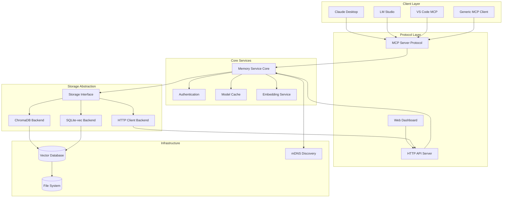

# MCP Memory Service Architecture

## Overview

MCP Memory Service is a Model Context Protocol server that provides semantic memory and persistent storage capabilities for AI assistants. It enables long-term memory storage with semantic search, time-based recall, and tag-based organization across conversations.

## System Architecture



## Core Components

### 1. Server Layer (`src/mcp_memory_service/server.py`)

The main server implementation that handles MCP protocol communication:

- **Protocol Handler**: Implements the MCP protocol specification
- **Request Router**: Routes incoming requests to appropriate handlers
- **Response Builder**: Constructs protocol-compliant responses
- **Client Detection**: Identifies and adapts to different MCP clients (Claude Desktop, LM Studio, etc.)
- **Logging System**: Client-aware logging with JSON compliance for Claude Desktop

Key responsibilities:
- Async request handling with proper error boundaries
- Global model and embedding cache management
- Lazy initialization of storage backends
- Tool registration and invocation

### 2. Storage Abstraction Layer (`src/mcp_memory_service/storage/`)

Abstract interface that allows multiple storage backend implementations:

#### Base Interface (`storage/base.py`)
```python
class MemoryStorage(ABC):
    async def initialize() -> None
    async def store(memory: Memory) -> Tuple[bool, str]
    async def retrieve(query: str, n_results: int) -> List[MemoryQueryResult]
    async def search_by_tag(tags: List[str]) -> List[Memory]
    async def delete(content_hash: str) -> Tuple[bool, str]
    async def recall_memory(query: str, n_results: int) -> List[Memory]
```

#### ChromaDB Backend (`storage/chroma.py`)
- Primary vector database backend
- Sentence transformer embeddings
- Persistent storage with automatic backups
- Performance optimizations with caching

#### SQLite-vec Backend (`storage/sqlite_vec.py`)
- Lightweight alternative to ChromaDB
- Native SQLite with vector extension
- Better performance for smaller datasets
- Lower memory footprint

#### HTTP Client Backend (`storage/http_client.py`)
- Remote storage via HTTP API
- Enables distributed deployments
- Authentication support
- Automatic retry logic

### 3. Models Layer (`src/mcp_memory_service/models/`)

Data structures and validation:

```python
@dataclass
class Memory:
    id: str
    content: str
    content_hash: str
    memory_type: str
    tags: List[str]
    metadata: MemoryMetadata
    created_at: datetime
    updated_at: datetime

@dataclass
class MemoryMetadata:
    source: Optional[str]
    client_id: Optional[str]
    session_id: Optional[str]
    parent_memory_id: Optional[str]
    child_memory_ids: List[str]
```

### 4. Web Interface (`src/mcp_memory_service/web/`)

Modern web dashboard for memory management:

- **Frontend**: Responsive React-based UI
- **API Routes**: RESTful endpoints for memory operations
- **WebSocket Support**: Real-time updates
- **Authentication**: API key-based authentication
- **Health Monitoring**: System status and metrics

### 5. Configuration Management (`src/mcp_memory_service/config.py`)

Environment-based configuration with sensible defaults:

- Storage backend selection
- Model selection and caching
- Platform-specific optimizations
- Hardware acceleration detection (CUDA, MPS, DirectML, ROCm)
- Network configuration (HTTP, HTTPS, mDNS)

## Key Design Patterns

### Async/Await Pattern
All I/O operations use Python's async/await for non-blocking execution:
```python
async def store_memory(self, content: str) -> Memory:
    embedding = await self._generate_embedding(content)
    memory = await self.storage.store(content, embedding)
    return memory
```

### Lazy Initialization
Resources are initialized only when first needed:
```python
async def _ensure_storage_initialized(self):
    if self.storage is None:
        self.storage = await create_storage_backend()
    return self.storage
```

### Global Caching Strategy
Model and embedding caches are shared globally to reduce memory usage:
```python
_MODEL_CACHE = {}
_EMBEDDING_CACHE = LRUCache(maxsize=1000)
```

### Platform Detection and Optimization
Automatic detection and optimization for different platforms:
- **macOS**: MPS acceleration for Apple Silicon
- **Windows**: CUDA or DirectML
- **Linux**: CUDA, ROCm, or CPU
- **Fallback**: ONNX Runtime for compatibility

## MCP Protocol Operations

### Core Memory Operations

| Operation | Description | Parameters |
|-----------|-------------|------------|
| `store_memory` | Store new memory with tags | content, tags, metadata |
| `retrieve_memory` | Semantic search | query, n_results |
| `recall_memory` | Time-based retrieval | time_expression, n_results |
| `search_by_tag` | Tag-based search | tags[] |
| `delete_memory` | Delete by hash | content_hash |
| `delete_by_tags` | Bulk deletion | tags[] |

### Utility Operations

| Operation | Description | Parameters |
|-----------|-------------|------------|
| `check_database_health` | Health status | - |
| `optimize_db` | Database optimization | - |
| `export_memories` | Export to JSON | output_path |
| `import_memories` | Import from JSON | input_path |
| `get_memory_stats` | Usage statistics | - |

### Debug Operations

| Operation | Description | Parameters |
|-----------|-------------|------------|
| `debug_retrieve` | Detailed similarity scores | query, n_results |
| `exact_match_retrieve` | Exact content matching | query |

## Data Flow

### Memory Storage Flow
```
1. Client sends store_memory request
2. Server validates and enriches metadata
3. Content is hashed for deduplication
4. Text is embedded using sentence transformers
5. Memory is stored in vector database
6. Confirmation returned to client
```

### Memory Retrieval Flow
```
1. Client sends retrieve_memory request
2. Query is embedded to vector representation
3. Vector similarity search performed
4. Results ranked by similarity score
5. Metadata enriched results returned
```

### Time-Based Recall Flow
```
1. Client sends recall_memory with time expression
2. Time parser extracts temporal boundaries
3. Semantic query combined with time filter
4. Filtered results returned chronologically
```

## Performance Optimizations

### Model Caching
- Sentence transformer models cached globally
- Single model instance shared across requests
- Lazy loading on first use

### Embedding Cache
- LRU cache for frequently used embeddings
- Configurable cache size
- Cache hit tracking for optimization

### Query Optimization
- Batch processing for multiple operations
- Connection pooling for database access
- Async I/O for non-blocking operations

### Platform-Specific Optimizations
- Hardware acceleration auto-detection
- Optimized tensor operations per platform
- Fallback strategies for compatibility

## Security Considerations

### Authentication
- API key-based authentication for HTTP endpoints
- Bearer token support
- Per-client authentication in multi-client mode

### Data Privacy
- Content hashing for deduplication
- Optional encryption at rest
- Client isolation in shared deployments

### Network Security
- HTTPS support with SSL/TLS
- CORS configuration for web access
- Rate limiting for API endpoints

## Deployment Architectures

### Single User Desktop
- Local ChromaDB/SQLite storage
- Direct MCP protocol communication
- Minimal resource usage

### Multi-Client Shared
- Centralized HTTP server
- Multiple clients via API
- Authentication required
- Shared memory pool

### Distributed Cloud
- HTTP client backend
- Load balancing support
- Horizontal scaling
- Cloud storage integration

## Extension Points

### Custom Storage Backends
Implement the `MemoryStorage` abstract base class:
```python
class CustomStorage(MemoryStorage):
    async def store(self, memory: Memory) -> Tuple[bool, str]:
        # Custom implementation
```

### Custom Embedding Models
Replace the default sentence transformer:
```python
EMBEDDING_MODEL = "your-model/name"
```

### Protocol Extensions
Add new operations via tool registration:
```python
types.Tool(
    name="custom_operation",
    description="Custom memory operation",
    inputSchema={...}
)
```

## Future Enhancements

### Planned Features
- Graph-based memory relationships
- Automatic memory consolidation
- Semantic clustering
- Memory importance scoring
- Cross-conversation threading

### Under Consideration
- Agentic RAG for intelligent retrieval
- Memory compression strategies
- Federated learning from memories
- Real-time collaboration features
- Advanced visualization tools

## References

- [MCP Protocol Specification](https://modelcontextprotocol.io/docs)
- [ChromaDB Documentation](https://docs.trychroma.com/)
- [SQLite Vec Extension](https://github.com/asg017/sqlite-vec)
- [Sentence Transformers](https://www.sbert.net/)