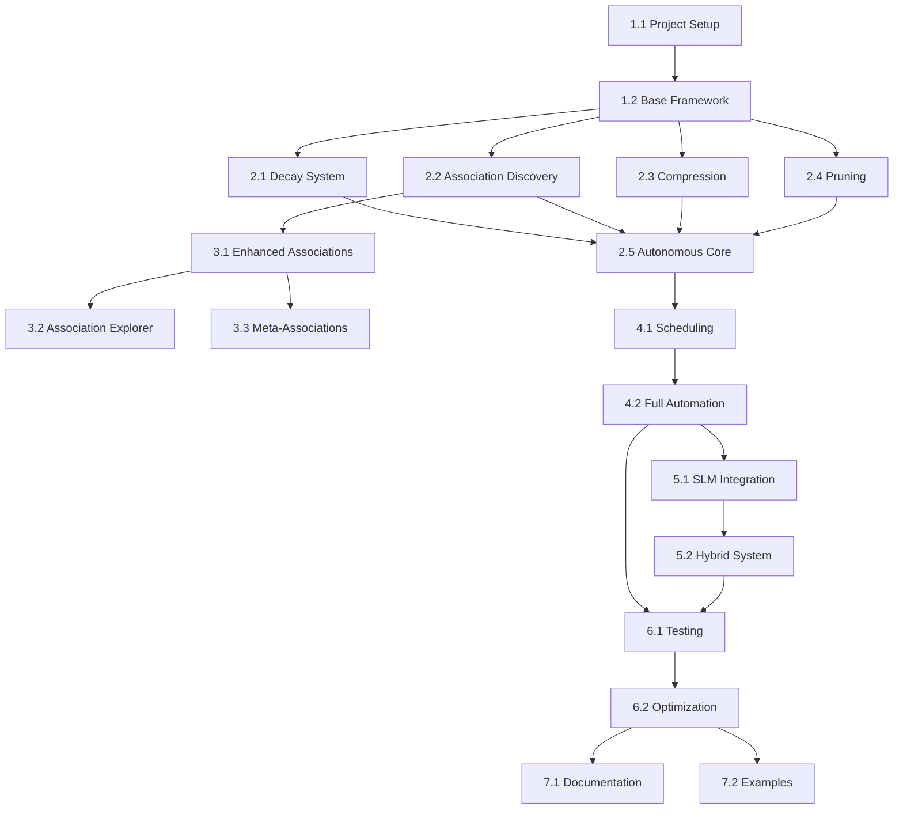

# Memory Consolidation Implementation Plan

## Overview

This implementation plan provides a structured roadmap for Claude Code to implement the complete dream-inspired memory consolidation system with autonomous operation, optional SLM enhancement, and elegant association storage.

## Project Structure

```
mcp-memory-service/
├── src/
│   ├── consolidation/
│   │   ├── __init__.py
│   │   ├── base.py                    # Base consolidator interface
│   │   ├── autonomous.py              # Autonomous consolidation engine
│   │   ├── associations.py            # Association discovery & storage
│   │   ├── compression.py             # Semantic compression engine
│   │   ├── decay.py                   # Exponential decay calculator
│   │   ├── pruning.py                 # Controlled forgetting engine
│   │   └── scheduling.py              # Cron-based scheduler
│   ├── slm/
│   │   ├── __init__.py
│   │   ├── base.py                    # SLM interface
│   │   ├── ollama_client.py          # Ollama integration
│   │   └── hybrid_consolidator.py    # Hybrid SLM enhancement
│   └── storage/
│       └── association_queries.py      # Association-specific queries
├── tests/
│   └── consolidation/
│       ├── test_autonomous.py
│       ├── test_associations.py
│       ├── test_compression.py
│       └── test_integration.py
└── examples/
    ├── basic_consolidation.py
    ├── association_explorer.py
    └── visualization.py
```

## Implementation Milestones

### Phase 1: Foundation (Week 1-2)
**Goal**: Set up core infrastructure and base classes

#### Milestone 1.1: Project Setup
```python
# Tasks for Claude Code:
1. Create project structure
2. Add dependencies to pyproject.toml:
   - numpy
   - scikit-learn
   - apscheduler
   - Optional: ollama (for SLM enhancement)
3. Create base interfaces and configuration schema
4. Set up logging infrastructure
```

#### Milestone 1.2: Base Consolidator Framework
```python
# src/consolidation/base.py
from abc import ABC, abstractmethod
from typing import Dict, List, Optional
from datetime import datetime

class BaseConsolidator(ABC):
    """Base interface for all consolidation strategies."""
    
    @abstractmethod
    async def consolidate(self, time_horizon: str) -> Dict:
        """Run consolidation for given time horizon."""
        pass
    
    @abstractmethod
    async def get_memories_for_horizon(self, time_horizon: str) -> List[Memory]:
        """Retrieve memories for consolidation."""
        pass

# Configuration schema
class ConsolidationConfig:
    decay_enabled: bool = True
    retention_periods: Dict[str, int]
    association_discovery: bool = True
    compression_enabled: bool = True
    pruning_enabled: bool = True
    schedules: Dict[str, str]  # cron expressions
```

### Phase 2: Autonomous Core Components (Week 2-3)
**Goal**: Implement all autonomous consolidation features

#### Milestone 2.1: Exponential Decay System
```python
# src/consolidation/decay.py
# Implement:
- ExponentialDecayCalculator class
- Configurable retention periods by memory type
- Connection boost calculation
- Batch relevance score updates
```

#### Milestone 2.2: Creative Association Discovery
```python
# src/consolidation/associations.py
# Implement:
- AssociationDiscoveryEngine
- Similarity calculation (0.3-0.7 sweet spot)
- Association memory creation
- Metadata-rich association storage
- Batch processing for efficiency
```

#### Milestone 2.3: Clustering & Compression
```python
# src/consolidation/compression.py
# Implement:
- Memory clustering using DBSCAN/Agglomerative
- Centroid-based representative selection
- TF-IDF keyword extraction
- Structured summary generation
- Compression ratio calculation
```

#### Milestone 2.4: Controlled Forgetting
```python
# src/consolidation/pruning.py
# Implement:
- Rule-based forgetting logic
- Protected tag handling
- Archive functionality
- Compression before archival
- Audit trail maintenance
```

### Phase 3: Association Storage System (Week 3-4)
**Goal**: Implement association storage as first-class memories

#### Milestone 3.1: Enhanced Association Engine
```python
# src/consolidation/associations.py (enhanced)
# Implement:
- Store associations as memories with rich metadata
- Association type classification
- Insight generation (rule-based initially)
- Temporal tracking
- Importance score calculation for associations
```

#### Milestone 3.2: Association Explorer
```python
# src/storage/association_queries.py
# Implement:
- Path finding between memories (BFS/DFS)
- Connection strength queries
- Cluster detection from associations
- Meta-pattern discovery
- Convergence point identification
```

#### Milestone 3.3: Meta-Association Discovery
```python
# src/consolidation/associations.py
# Implement:
- Second-order association detection
- Convergence pattern identification
- Association chain discovery
- Meta-pattern storage
- Emergent structure detection
```

### Phase 4: Scheduling & Automation (Week 4)
**Goal**: Make the system fully autonomous

#### Milestone 4.1: Scheduling Infrastructure
```python
# src/consolidation/scheduling.py
# Implement:
- APScheduler integration
- Configurable cron schedules
- Time horizon management
- Graceful error handling
- Consolidation status tracking
```

#### Milestone 4.2: Autonomous Consolidator Integration
```python
# src/consolidation/autonomous.py
# Implement:
- Full consolidation pipeline
- Time-based processing strategies
- Report generation
- Performance metrics
- Health monitoring
```

### Phase 5: Optional SLM Enhancement (Week 5)
**Goal**: Add optional local AI capabilities

#### Milestone 5.1: SLM Integration Layer
```python
# src/slm/ollama_client.py
# Implement:
- Ollama client wrapper
- Model availability checking
- Graceful fallback handling
- Response caching
- Token limit management
```

#### Milestone 5.2: Hybrid Consolidator
```python
# src/slm/hybrid_consolidator.py
# Implement:
- Selective enhancement logic
- Natural language summary generation
- Creative insight extraction
- Smart resource management
- Performance/quality trade-offs
```

### Phase 6: Testing & Optimization (Week 6)
**Goal**: Ensure reliability and performance

#### Milestone 6.1: Comprehensive Test Suite
```python
# tests/consolidation/
# Implement:
- Unit tests for each component
- Integration tests for full pipeline
- Performance benchmarks
- Edge case handling
- Mock data generators
```

#### Milestone 6.2: Performance Optimization
```python
# Tasks:
- Profile memory usage
- Optimize embedding calculations
- Implement batch processing
- Add caching where beneficial
- Parallel processing for independent tasks
```

### Phase 7: Documentation & Examples (Week 7)
**Goal**: Make the system easy to use and understand

#### Milestone 7.1: User Documentation
```markdown
# Create:
- Installation guide
- Configuration reference
- API documentation
- Troubleshooting guide
- Performance tuning guide
```

#### Milestone 7.2: Example Applications
```python
# examples/
# Create:
- Basic consolidation example
- Association exploration demo
- Visualization scripts
- Configuration templates
- Migration guide from basic system
```

## Implementation Order & Dependencies



## Configuration Template

```yaml
# config/consolidation.yaml
consolidation:
  # Core settings
  enabled: true
  mode: "autonomous"  # autonomous, hybrid_selective, hybrid_full
  
  # Decay configuration
  decay:
    enabled: true
    retention_periods:
      critical: 365
      reference: 180
      standard: 30
      temporary: 7
      association: 90  # Associations decay slower
  
  # Association discovery
  associations:
    enabled: true
    min_similarity: 0.3
    max_similarity: 0.7
    max_pairs_per_run: 100
    store_as_memories: true
    discover_meta_patterns: true
  
  # Compression settings
  compression:
    enabled: true
    min_cluster_size: 5
    clustering_threshold: 0.3
    keyword_count: 20
  
  # Forgetting settings
  forgetting:
    enabled: true
    relevance_threshold: 0.1
    access_threshold_days: 90
    protected_tags: ["important", "critical", "reference"]
    archive_path: "./memory_archive"
  
  # Scheduling (cron expressions)
  schedules:
    daily: "0 3 * * *"      # 3 AM
    weekly: "0 4 * * 1"     # 4 AM Mondays
    monthly: "0 5 1 * *"    # 5 AM first of month
    quarterly: "0 6 1 */3 *" # 6 AM quarterly
    yearly: "0 7 1 1 *"     # 7 AM January 1st
  
  # Optional SLM enhancement
  slm:
    enabled: false
    model: "llama3.2:1b"
    min_cluster_size_for_slm: 5
    min_importance_for_slm: 0.7
    max_tokens_per_summary: 150
```

## Key Implementation Guidelines for Claude Code

### 1. **Incremental Development**
- Start with autonomous components (no external dependencies)
- Add features incrementally with tests
- Ensure each milestone is functional before moving on

### 2. **Maintain Backwards Compatibility**
- Don't break existing memory storage
- Add new features as optional enhancements
- Provide migration scripts if needed

### 3. **Performance Considerations**
- Use batch operations for database queries
- Implement caching for expensive calculations
- Consider memory usage with large datasets
- Profile before optimizing

### 4. **Error Handling**
- Graceful degradation (if SLM fails, fall back to autonomous)
- Comprehensive logging for debugging
- Never lose user data (always backup before risky operations)

### 5. **Testing Strategy**
- Unit tests for each component
- Integration tests for the full pipeline
- Performance benchmarks
- Test with real-world data volumes

## Success Criteria

### Phase 1-2: Autonomous System
- [ ] Decay calculation works correctly
- [ ] Associations are discovered and stored
- [ ] Compression reduces storage by >50%
- [ ] Pruning archives old memories safely
- [ ] System runs without external dependencies

### Phase 3: Association Storage
- [ ] Associations queryable as memories
- [ ] Path finding works between memories
- [ ] Meta-patterns are discovered
- [ ] No performance degradation

### Phase 4: Automation
- [ ] Scheduled consolidation runs reliably
- [ ] No memory leaks over time
- [ ] Graceful error recovery
- [ ] Status monitoring available

### Phase 5: SLM Enhancement (Optional)
- [ ] Works without SLM
- [ ] Enhances quality when available
- [ ] No significant performance impact
- [ ] Falls back gracefully

### Phase 6-7: Production Ready
- [ ] >90% test coverage
- [ ] Performance meets targets
- [ ] Documentation is complete
- [ ] Examples demonstrate all features

## Monitoring & Metrics

```python
# Key metrics to track:
metrics = {
    "memories_processed": int,
    "associations_discovered": int,
    "clusters_formed": int,
    "memories_compressed": int,
    "memories_archived": int,
    "processing_time_seconds": float,
    "memory_usage_mb": float,
    "storage_saved_mb": float,
    "errors_encountered": int,
    "slm_enhancements_applied": int
}
```

## Future Enhancements (Post-MVP)

1. **Advanced Visualization**
   - Memory landscape visualization
   - Association graph explorer
   - Temporal heat maps

2. **Fine-tuned Models**
   - Train small models specifically for memory tasks
   - Custom embedding models

3. **Multi-user Support**
   - User-specific consolidation strategies
   - Shared knowledge spaces
   - Privacy controls

4. **Advanced Patterns**
   - Predictive associations
   - Anomaly detection
   - Trend analysis

## Conclusion

This implementation plan provides Claude Code with a clear, structured approach to building the complete memory consolidation system. The phased approach ensures that each component is solid before building on it, while maintaining the elegant simplicity that makes this system special.

The beauty of this plan is that it starts with zero external dependencies (Phase 1-4), adds optional enhancements (Phase 5), and results in a production-ready system that can run autonomously forever, discovering insights and organizing knowledge like a dreaming mind.

---

**Estimated Timeline**: 7 weeks for complete implementation
**Complexity**: Moderate (due to good modularization)
**Risk**: Low (incremental approach with fallbacks)

*Created: July 28, 2025*